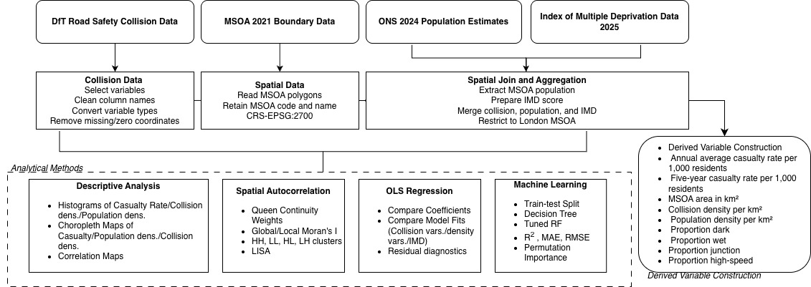
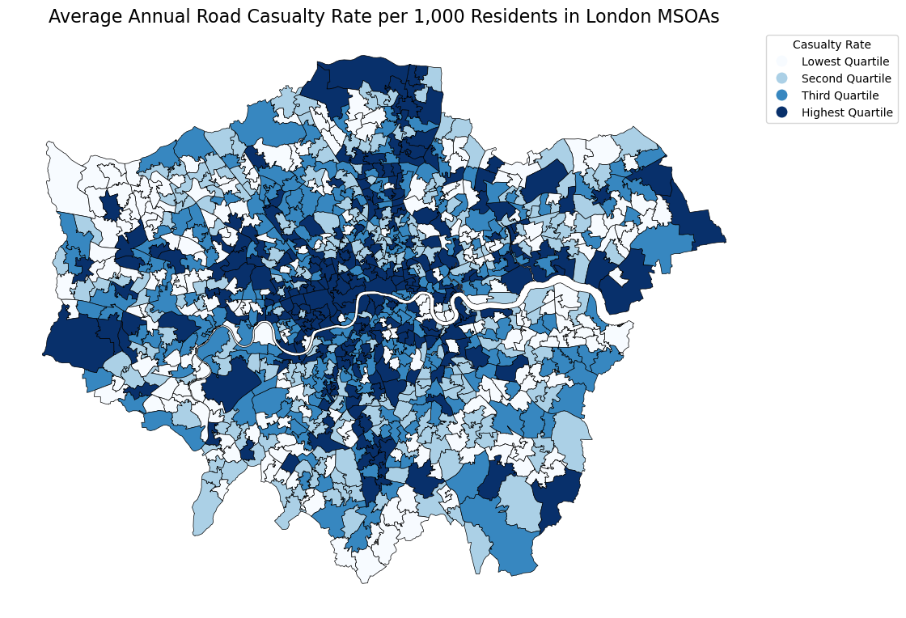
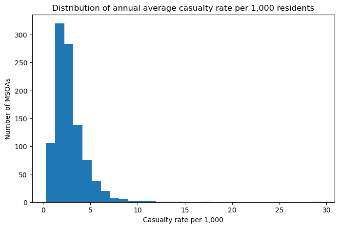
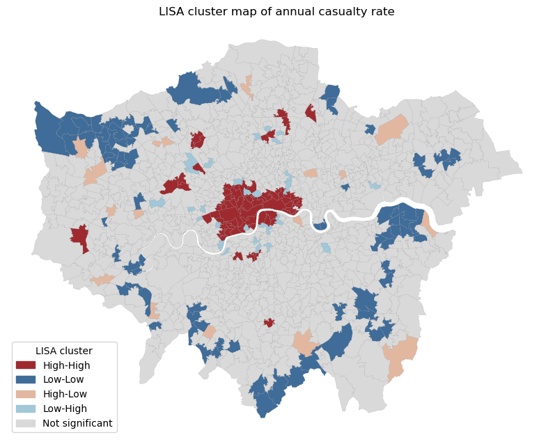
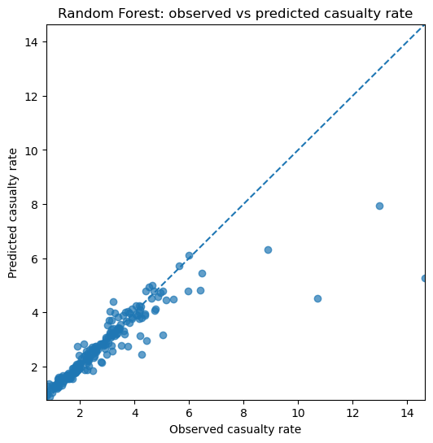
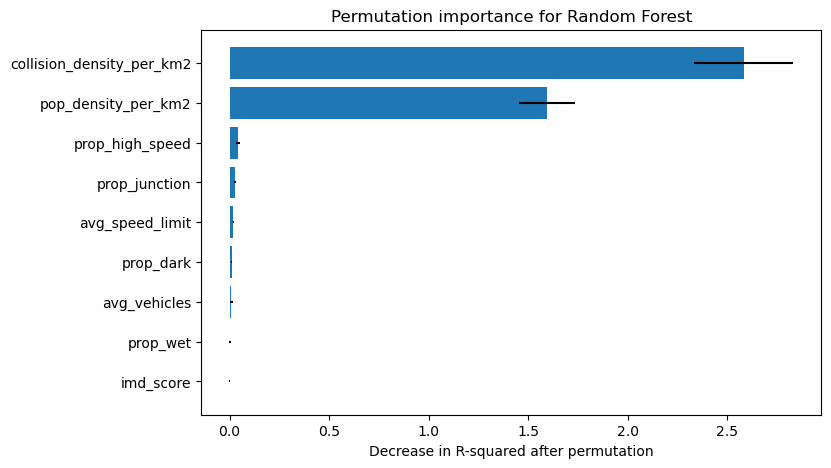

## Project Overview

This project investigates spatial inequality in road casualty risk across London neighbourhoods. It combines Department for Transport casualty records, MSOA boundaries, population data and deprivation indicators to examine where annual casualty rates are highest, whether high-risk areas cluster spatially, and how well neighbourhood conditions can explain or predict casualty risk.

[Download the notebook](coursework/dsss-road-casualty/road-casualty-risk-london.ipynb){target="_blank"}

## Research Focus

- How unevenly are annual road casualty rates distributed across London MSOAs?
- Do high-rate and low-rate MSOAs show significant spatial clustering?
- Which spatial, traffic-context and deprivation variables help explain casualty risk?
- Can tree-based models improve prediction beyond an interpretable OLS baseline?

## Methods

- Spatial joining of road casualty records to 2021 MSOA boundaries.
- Construction of annual casualty rates per 1,000 residents.
- Collision density and population density measures.
- Global Moran's I and Local Indicators of Spatial Association.
- Nested OLS modelling for interpretable explanation.
- Decision Tree and Random Forest regression.
- Permutation importance and partial dependence plots for model interpretation.

## Workflow

## Selected Outputs

## Key Findings

Road casualty risk is unevenly distributed across London MSOAs and shows clear spatial structure rather than random variation. The analysis identifies hotspot and coldspot patterns, confirming that local risk is shaped by neighbourhood context.

The modelling results suggest that spatial-intensity variables, especially collision density, are important predictors of casualty rates. Random Forest modelling improves predictive performance and captures non-linear relationships, although the highest-risk outliers remain harder to predict.

[Back to coursework](coursework.qmd)
